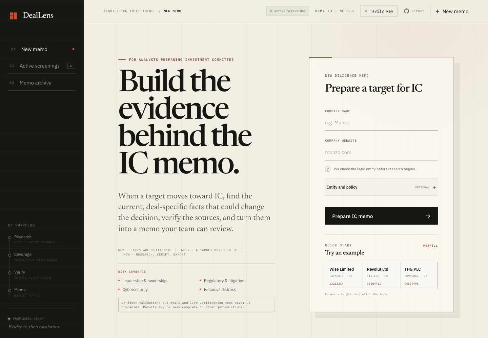
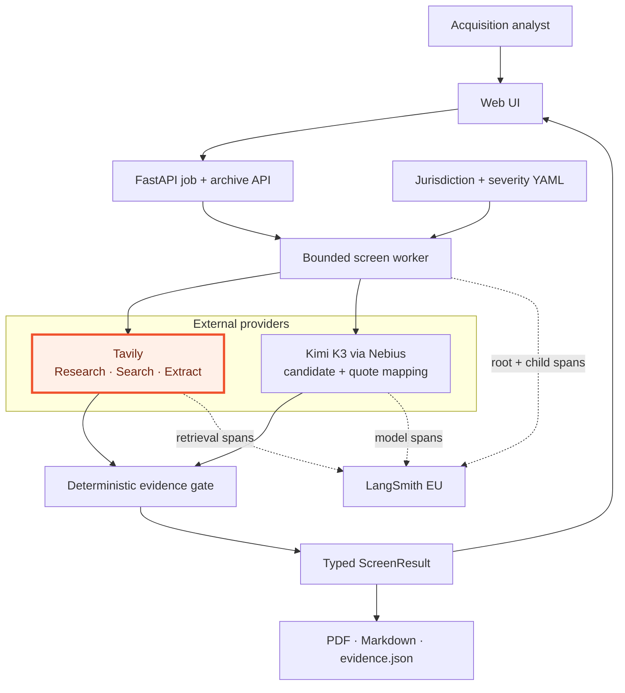
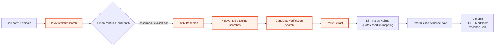
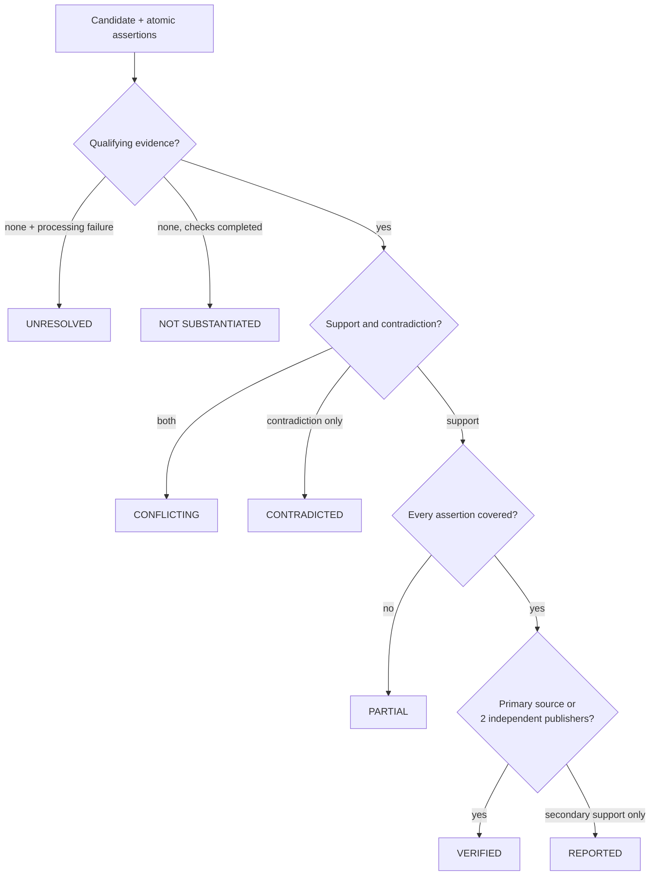
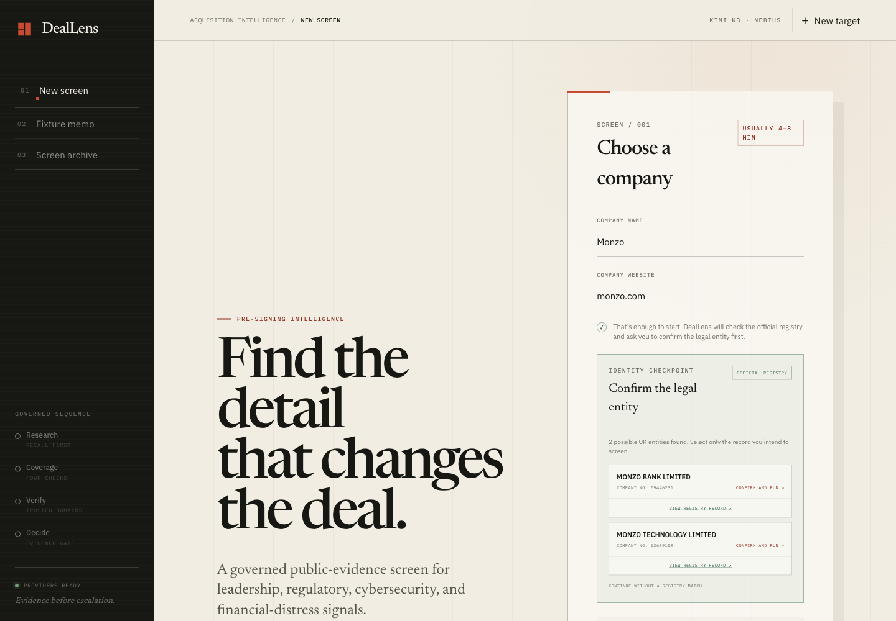
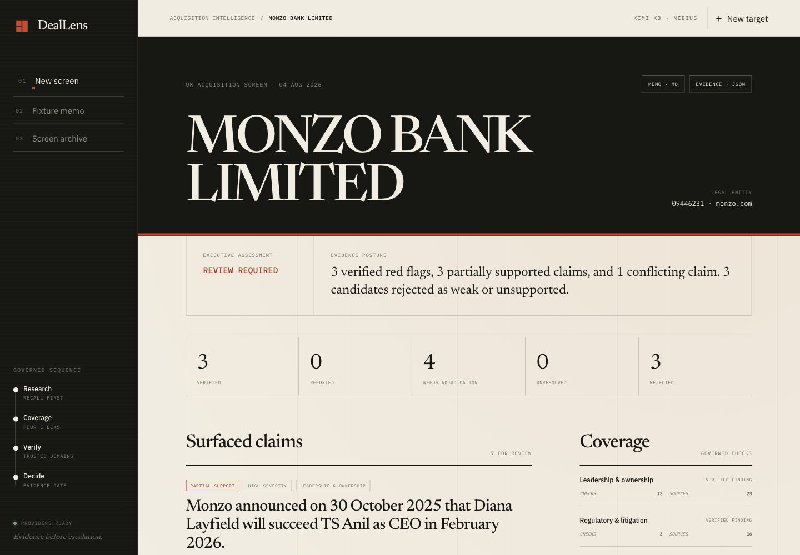

# DealLens

**The acquisition-intelligence layer for investment committee preparation.**

**Live website:** [Open DealLens](https://deallens-rflyxruzvq-ez.a.run.app/)

**Hosting:** Google Cloud Platform (GCP), deployed as a containerized service
on Cloud Run.

When a target moves toward investment committee, analysts have to assemble the
specific facts that could change the decision: leadership departures,
regulatory scrutiny, litigation, breaches, and signs of financial distress.
Those facts are scattered across the live web, easy to confuse with another
legal entity, and difficult to cite consistently under time pressure.

DealLens fits into that existing memo workflow. It turns a company name and
website into a current, cited public-risk assessment that an analyst can
review, edit, and export for IC. Tavily provides live discovery, search, and
extraction; Kimi K3 runs through Nebius Token Factory; deterministic Python
applies the source, entity, and evidence rules.

> DealLens is a triage tool, not a legal or financial opinion. “No qualifying
> findings” means four governed checks completed without qualifying public
> evidence; it never means the company is cleared.



## Product walkthrough

[Watch the 58-second DealLens demo on YouTube](https://youtu.be/lMgXx2dGhcg)

## Why, when, and how

| | Role in the analyst workflow |
|---|---|
| **Why** | IC memo preparation is evidence assembly, not just writing. Decision-relevant details must be current, entity-matched, and traceable to a source. |
| **When** | Use DealLens after a target clears initial interest and before the IC discussion, when the team needs a defensible first-pass view of public risk. |
| **How** | Confirm the legal entity, research four acquisition-risk areas, verify each claim against governed sources, review the evidence, and export the memo as PDF or Markdown. |

DealLens does not make the investment decision or certify legal compliance. It
gives the analyst a governed, auditable evidence package that supports IC,
compliance, and specialist diligence review.

> **UK-first validation.** The evaluation suite and completed live verification
> runs cover UK companies. Results may be less complete in other jurisdictions;
> the Netherlands source pack remains an unvalidated preview.

## Risk coverage

Every screen checks the same four acquisition-risk areas, even when Tavily
Research proposes no candidate finding:

| Area | Signals reviewed |
|---|---|
| **Leadership & ownership** | Director, founder, CEO, CFO, and ownership changes |
| **Regulatory & litigation** | Investigations, enforcement actions, penalties, and material court proceedings |
| **Cybersecurity** | Ransomware, security incidents, and customer-data breaches |
| **Financial distress** | Insolvency, administration, overdue filings, layoffs, closures, and funding pressure |

For each area, the memo records checks run, sources reviewed, and whether there
is a verified finding, a reported signal, no qualifying finding, or a gap that
requires human review.

## Why this is different

Most research agents let the same model discover a claim and grade it. DealLens
separates recall from trust:

- Tavily `/research` proposes concrete, dateable candidate events.
- Tavily `/search` always runs a governed baseline for all four categories,
  then verifies each candidate against configured source tiers.
- Tavily `/extract` returns claim-focused page content.
- Kimi K3 identifies candidate claims, copies evidence passages, maps them to
  atomic assertions, and writes bounded memo prose.
- Deterministic code checks legal-entity identity, publisher independence,
  verbatim quote provenance, assertion coverage, status, and severity.

The model can suggest evidence. It cannot award itself `VERIFIED`.

### Runtime architecture

The model and retrieval providers sit outside the decision boundary. Only the
deterministic gate can assign an evidence status or roll findings into the IC
assessment.

Tavily-owned retrieval components are highlighted in orange throughout the
architecture diagrams.



### Retrieval and decision path



### Evidence state machine



The full component, sequence, trust-boundary, and trace diagrams are in
[docs/ARCHITECTURE.md](docs/ARCHITECTURE.md).

## Try it

### Zero-credit fixture

```bash
uv sync
uv run deallens demo
uv run deallens eval
uv run pytest
```

The fixture exercises the real quote validator, assertion gate, severity
policy, coverage roll-up, and memo renderer without network calls or API keys.

### Analyst interface

```bash
uv run deallens web
```

### Deploy to Google Cloud Run

The repository includes a production container and Cloud Build configuration.
Store provider credentials in Secret Manager rather than putting `.env` in the
image. DealLens keeps active jobs in memory and writes completed reports to the
container filesystem, so the initial Cloud Run deployment should use one
always-allocated instance. Durable multi-instance job storage is a future
architecture step.

```bash
gcloud builds submit \
  --config cloudbuild.yaml \
  --substitutions _IMAGE=europe-west4-docker.pkg.dev/PROJECT/deallens/app:latest

gcloud run deploy deallens \
  --image europe-west4-docker.pkg.dev/PROJECT/deallens/app:latest \
  --region europe-west4 \
  --allow-unauthenticated \
  --min 1 --max 1 \
  --concurrency 2 \
  --timeout 3600 \
  --no-cpu-throttling \
  --set-secrets TAVILY_API_KEY=deallens-tavily:latest,NEBIUS_API_KEY=deallens-nebius:latest
```

Open <http://127.0.0.1:8000>. A new analyst enters only a company name and
website. If no company number is supplied, DealLens performs a Tavily search
restricted to the official registry and presents up to three locally ranked
candidates. The analyst must confirm one or explicitly continue without a
match before a paid screen starts.



The interface also includes:

- a server-backed active-screen ledger, so every queued or running target stays
  visible and resumable across targets and browser tabs;
- direct `?screen=<job-id>` resume links for reconnecting to a live run;
- duplicate-run protection while the same target is already active;
- retained Wise and Revolut example screens on a fresh clone;
- category coverage and source-review counts;
- atomic assertion support/contradiction relationships;
- verbatim evidence with clickable source links; and
- direct PDF, Markdown, and JSON exports from both completed memos and the
  archive ledger.



### Live provider setup

```bash
cp .env.example .env
# Add TAVILY_API_KEY, NEBIUS_API_KEY, and LANGSMITH_API_KEY
uv run deallens web
```

Or run the pipeline directly:

```bash
uv run deallens screen \
  --company "Monzo Bank Limited" \
  --domain "monzo.com" \
  --company-id "09446231" \
  --jurisdiction UK
```

The supported LLM path is explicit:

```env
DEALLENS_MODEL="moonshotai/Kimi-K3"
```

Kimi K3 is invoked through `langchain-nebius` and Nebius Token Factory. There
is no Claude/Anthropic client or dependency in the project. Provider roles and
failure containment are described in
[TECHNICAL_STATEMENT.md](TECHNICAL_STATEMENT.md).

## Evidence contract

Every candidate claim is decomposed into atomic assertions. Each assertion is
evaluated separately:

| Status | Deterministic rule |
|---|---|
| **Verified** | Every assertion has one primary source or two independent credible-secondary publishers |
| **Reported** | Every assertion has support, but at least one has only one credible-secondary publisher |
| **Partial** | Some, but not all, assertions have qualifying support |
| **Conflicting** | Qualifying evidence both supports and contradicts the claim |
| **Contradicted** | Qualifying evidence directly refutes the claim |
| **Unresolved** | Retrieval or classification failed; human review is required |
| **Not substantiated** (`rejected` internally) | Available sources did not meet the evidence standard; this does not mean the claim is false |

Additional invariants:

1. A quote must occur in Tavily-extracted content after whitespace and
   punctuation normalization; paraphrases are discarded, not repaired.
2. Two pages from one configured publisher count as one publisher.
3. Companies House evidence for a different company number is rejected.
4. Search, author, tag, and sitemap pages cannot become evidence documents.
5. A failed category interpretation becomes `REVIEW REQUIRED`, never a clean
   category.
6. Severity comes from YAML policy after evidence status is determined.

## Evaluation

`uv run deallens eval` is offline, deterministic, baseline-aware, and
CI-gating. It reports case-level regressions, refuses silent coverage removal,
and preserves a machine-readable CI artifact. Current measured result:

| Suite | Result | Safety metric |
|---|---:|---:|
| Evidence gate + quote validation | 16/16 | 0/11 false verifies |
| Legal-entity ranking | 8/8 | 4/4 correct abstentions |
| Source-governance contract | 12/12 | all tier/entity/document boundaries correct |
| **Total** | **36/36** | **all gates pass** |

The improvement loop is explicit: an observed failure becomes a human-labelled
offline fixture, production code is fixed against it, the result is compared
case-by-case with the committed baseline, and `--promote` updates that baseline
only after every safety gate holds.

```bash
uv run deallens eval --json-out reports/evals/local-run.json
uv run deallens eval --promote  # after label and result review
```

The pytest suite is **74/74 passing**. Labels, the promote/review loop,
limitations, and the machine-readable command are documented in
[docs/EVALUATION.md](docs/EVALUATION.md); the committed case-level baseline is
[docs/evaluation-results.json](docs/evaluation-results.json).

## LangSmith observability

Live tracing uses one root `deallens.screen` span with nested discovery,
baseline, verification, capture, Tavily, and Nebius model spans. Root metadata
includes target, jurisdiction, pipeline version, provider/model, candidate and
finding counts, risk result, Tavily credits by endpoint, LLM tokens, and wall
time. Entity lookup is a separate `deallens.resolve_entity` trace because it
precedes user confirmation.

```env
LANGSMITH_TRACING="true"
LANGSMITH_API_KEY="lsv2_..."
LANGSMITH_PROJECT="Deal_Lens"
LANGSMITH_ENDPOINT="https://eu.api.smith.langchain.com"
```

Tests force tracing off before importing application modules, so fixtures do
not pollute the production project. See [docs/LANGSMITH.md](docs/LANGSMITH.md)
for the span contract and the verified Monzo run (`204` spans, `0` errors).

## Configuration and outputs

- `jurisdictions/uk.yaml`: source tiers, exclusions, and registry query.
- `jurisdictions/nl.yaml`: explicit preview stub; it is not claimed as tested.
- `policy.yaml`: standard severity policy.
- `policy.searchfund.yaml`: owner-operator/search-fund escalation profile.
- `reports/`: local run artifacts, ignored by Git.
- `examples/screens/`: curated public example artifacts used by the archive.

Each screen writes a Markdown memo and complete typed JSON evidence package.
The web app also renders a styled, source-linked PDF memo on demand for every
completed screen, including retained archive entries.
The usage ledger records Tavily credits per endpoint, Nebius token counts, wall
time, and an explicit `usage_complete` flag. It reads Tavily's dedicated
`research_usage` counter and briefly retries delayed updates; if the final
delta is not yet reflected, it marks the total incomplete rather than
overstating cost.

## Repository map

```text
src/deallens/
  entity.py         registry-constrained candidate resolution
  discover.py       Research + four-category baseline recall
  verify.py         trusted-domain and exact-entity search
  capture.py        query-focused Extract + quote relationship selection
  gate.py           deterministic assertion/source thresholds
  pipeline.py       orchestration, progress, trace metadata
  web.py            FastAPI job/archive/entity API
  ui/               dependency-free analyst interface
  evalrun.py        baseline-aware, three-suite evaluation harness
  memo.py           PDF/Markdown/JSON/console renderers
```

Submission documents:

- [TECHNICAL_STATEMENT.md](TECHNICAL_STATEMENT.md) — engineering argument and
  assignment mapping.
- [docs/ARCHITECTURE.md](docs/ARCHITECTURE.md) — detailed GitHub-rendered
  diagrams and component contracts.
- [docs/EVALUATION.md](docs/EVALUATION.md) — labels, baseline feedback loop,
  metrics, and known gaps.
- [docs/LANGSMITH.md](docs/LANGSMITH.md) — trace hierarchy and validation.
- [BUILD_LOG.md](BUILD_LOG.md) — product and implementation decisions.

## Deliberate MVP boundaries

- UK Companies House is the only tested automatic entity resolver. The NL pack
  demonstrates configuration shape but does not claim registry resolution.
- News articles do not contain a universal entity identifier; similarly named
  groups still require analyst judgment.
- Syndicated copy on genuinely different configured publisher domains may
  count twice; near-duplicate clustering is future work.
- `/research` is used for recall, not accepted as evidence by itself.
- Storage is local JSON/Markdown for this single-analyst MVP, with PDFs
  generated on demand from the typed result. MongoDB was
  deliberately deferred; adding infrastructure would not strengthen the core
  retrieval/evidence assignment.
- Tavily Crawl is not used. Search locates claim-relevant sources and Extract
  fetches only those pages, preserving page-level failure and cost accounting.

## License

No license has been selected. Treat this repository as evaluation material.
