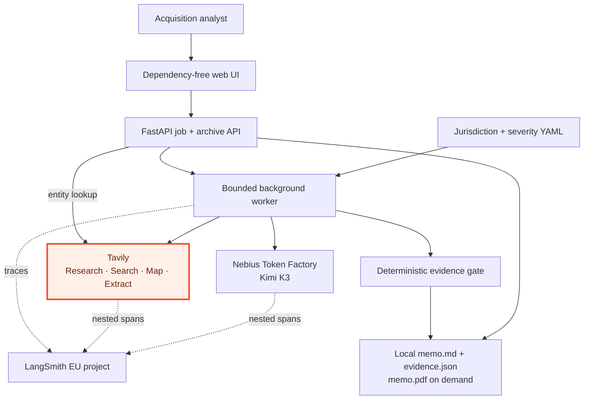
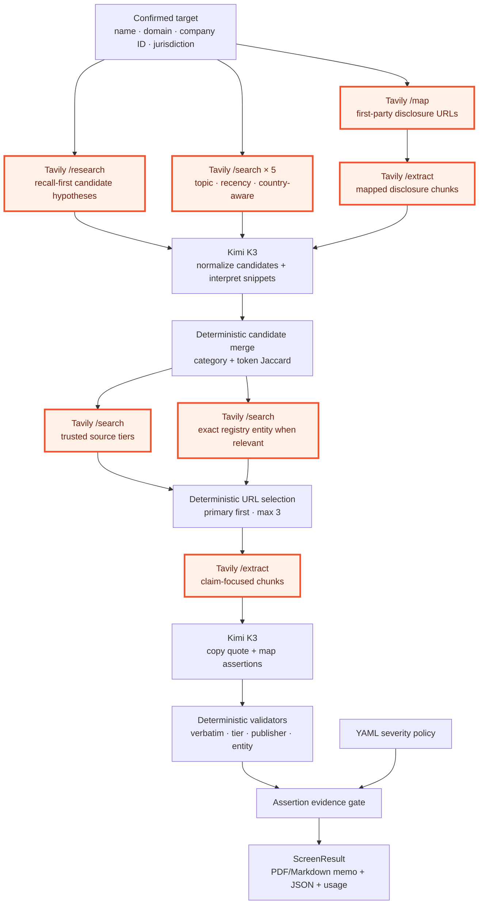
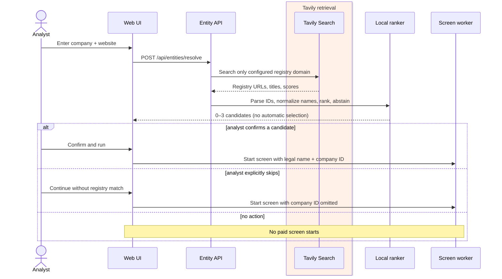
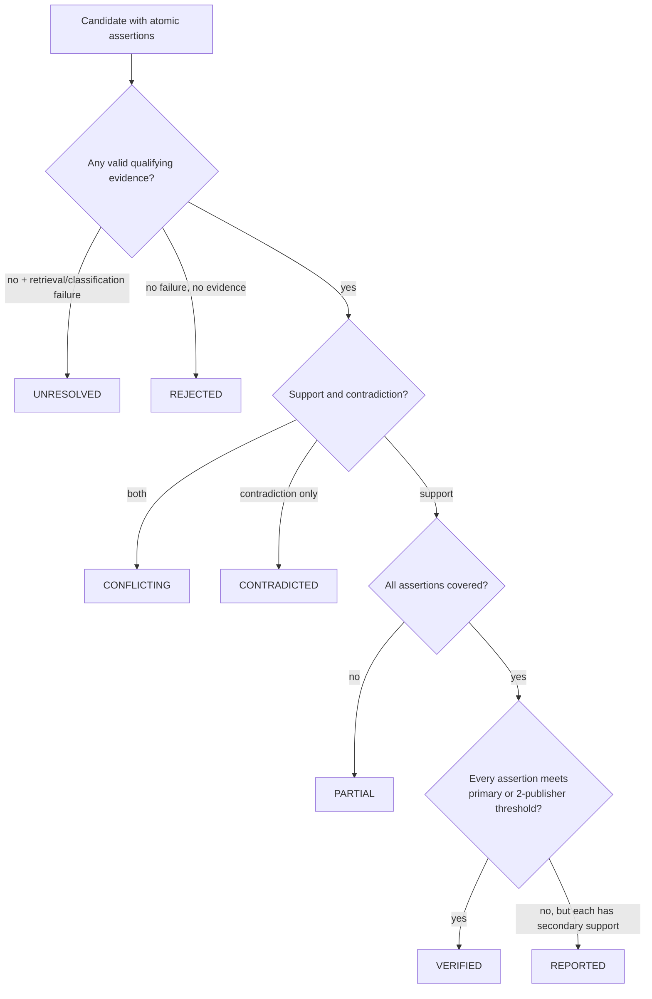
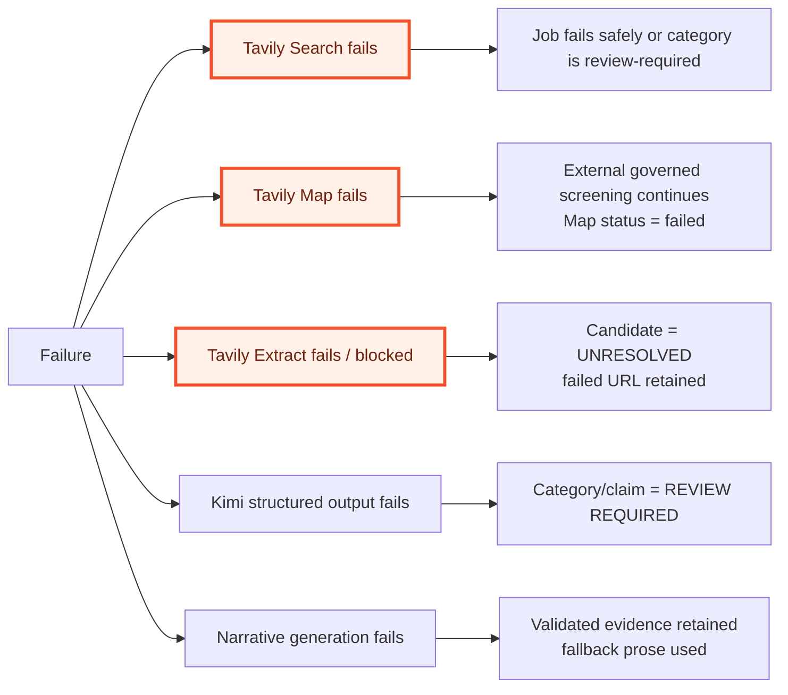
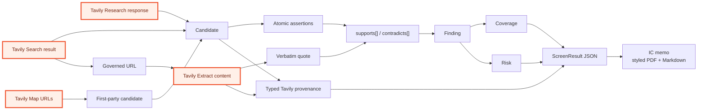
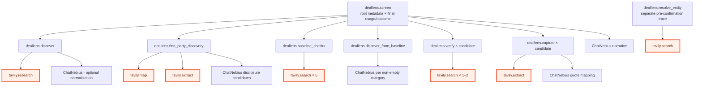
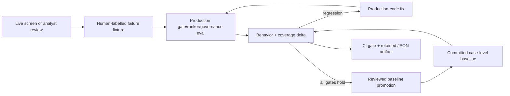

# Architecture

This document defines the runtime components, trust boundaries, retrieval
sequence, failure semantics, and LangSmith span structure for DealLens.
Tavily-owned retrieval components are highlighted in orange in every diagram
where they participate.

## 1. System context

The web layer renders the typed `ScreenResult`; it does not reproduce the
evidence gate in JavaScript. A failed worker has no clean result object and is
rendered as a failure state.

## 2. Retrieval and decision pipeline

### Component contracts

| Boundary | Accepts | Produces | May not do |
|---|---|---|---|
| Research | target identity, category prompt | candidate hypotheses | award evidence status |
| Baseline Search | category topic/recency policy, jurisdiction country boost, configured domains | snippets and URLs | use country boosting for non-general topics or treat empty results as clean |
| First-party Map | target domain, bounded disclosure instructions | relevant same-domain URLs | treat a company statement as independent verification |
| Verification Search | candidate query, source governance | candidate source set | bypass exclusions or entity mismatch |
| Extract | up to three selected URLs, claim query | focused page content + failed URLs | hide failed extraction |
| Kimi quote selection | extracted content, atomic assertions | copied passage and relationship indexes | rewrite a passage or decide verification |
| Evidence gate | validated typed evidence | finding status and risk roll-up | call providers or use model confidence |

## 3. New-user entity confirmation

The ranker accepts only exact configured registry hosts and canonical
Companies House `/company/{id}` paths. Low similarity, malformed paths, empty
titles, off-domain hosts, and duplicate IDs are rejected.

## 4. Evidence state machine

Severity is evaluated only after status. A high-severity report may escalate
the overall screen to `REVIEW REQUIRED`, but severity cannot upgrade evidence
from Reported to Verified.

## 5. Failure semantics

Missing observations are never converted to negative findings. The only clean
category state is `checked_no_finding`, which requires at least one completed
governed check and no surfaced qualifying finding or processing failure.

## 6. Data lineage

Every displayed source relationship survives in `evidence.json`, including
Tavily method/endpoint/query/relevance, retrieval time, URL, configured
publisher identity, source tier, quote, assertion indexes, claim-scoped
credits, extraction failures, and processing failures. First-party evidence is
typed separately and cannot independently satisfy the verification gate.
General-search provenance also records the country boost selected by the
jurisdiction pack.

## 7. LangSmith trace tree

Tests force `LANGSMITH_TRACING=false`; only explicit live operations enter the
`Deal_Lens` project.

## 8. Evaluation feedback loop

The harness uses model or analyst judgment only to establish the expected
label. Verification is deterministic and offline. A case deletion is treated
as a regression, duplicate case names are rejected, and promotion cannot occur
while a behavioral or safety-metric gate fails.

## 9. Persistence and concurrency

- `ThreadPoolExecutor(max_workers=2)` bounds local concurrent live screens.
- The public Cloud Run profile sets
  `DEALLENS_REQUIRE_PERSONAL_TAVILY_KEY=true`: entity resolution and new live
  screens require a request header and never fall back to a project-funded
  Tavily credential. The browser retains the request key only in page memory,
  sends it only to endpoints that call Tavily, and clears it on refresh or tab
  close. The key is omitted from job payloads and removed from the queued job
  as soon as the worker claims it; no key fingerprint is retained.
- API responses use `Cache-Control: no-store`. A restrictive Content Security
  Policy and companion referrer, framing, MIME-sniffing, and browser-permission
  headers reduce client-side credential exposure.
- `DEALLENS_LIVE_SCREEN_LIMIT=12`, one Cloud Run instance, and concurrency two
  bound server-funded Nebius exposure per container lifetime. Archived memos
  and the deterministic fixture do not consume that allowance.
- Jobs persist in process for progress/resume; completed outputs persist on
  disk beneath ignored `reports/web/{job_id}` directories.
- The archive discovers the latest output per legal entity and also serves five
  committed public examples from `examples/screens`. Both archived and newly
  completed screens expose PDF and Markdown memo downloads; PDFs are generated
  from the same typed `ScreenResult` used by the UI and JSON evidence package.
- This is intentionally single-node MVP infrastructure. A production service
  would move job state to a durable queue/database without changing the typed
  pipeline or evidence gate.
