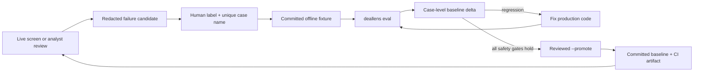

# Evaluation

DealLens evaluates the boundaries most likely to create an unsafe acquisition
screen: evidence over-verification, wrong legal-entity selection, and incorrect
source governance. All suites run offline from labelled JSON fixtures.

## Reproduce

```bash
uv sync
uv run deallens eval
uv run deallens eval --json-out reports/evals/local-run.json
uv run pytest
```

The command exits non-zero if any labelled case fails, a false verify is
introduced, entity-abstention accuracy falls, a previously passing case
regresses, or a labelled case is removed. CI runs both `pytest` and
`deallens eval`, then preserves the case-level JSON report even on failure.

## Feedback loop



The loop deliberately separates human judgment from deterministic proof.
An analyst decides the expected outcome; the harness runs the real production
gate, entity ranker, and governance functions against that label. Live web
content is not silently promoted into the fixture set.

### Add and promote a regression case

1. Reduce the observed failure to the smallest redacted fixture that still
   reproduces it.
2. Add it to the appropriate file under `fixtures/` with a unique case name.
3. Run `uv run deallens eval --json-out reports/evals/local-run.json`.
4. Fix the production behavior until the new case passes without weakening
   false-verify or abstention metrics.
5. Review the label and run `uv run deallens eval --promote`.
6. Commit the fixture and updated `docs/evaluation-results.json` together.

`--promote` refuses to replace the baseline while a case, safety metric, or
coverage-retention gate is failing. Duplicate case names are also rejected so
case history cannot be overwritten accidentally.

### Machine-readable contract

The versioned JSON report contains:

- `summary`: suite totals plus false-verify and abstention measures;
- `cases`: expected value, actual value, and pass/fail for every stable case
  name; and
- `baseline_comparison`: new, fixed, regressed, and removed cases plus metric
  deltas.

`docs/evaluation-results.json` is the reviewed baseline and intentionally omits
the transient comparison block. Local and CI reports include it so a failing
run remains diagnosable without rerunning the job.

## Current result

Measured on 2026-08-04 from the committed fixtures:

| Suite | Passed | Primary safety measure |
|---|---:|---:|
| Evidence gate + verbatim quote validation | 16/16 | false-verify rate 0/11 |
| Legal-entity ranking | 8/8 | correct abstention 4/4 |
| Source-governance contract | 12/12 | 12/12 full contract matches |
| **Total** | **36/36** | **all gates pass** |

The associated unit/API suite passes **84/84** tests.

The committed machine-readable baseline, including every case result, is
[evaluation-results.json](evaluation-results.json).

### Per-screen retrieval ablation

Live and recorded screens also emit a typed retrieval contribution block in
`evidence.json` and the memo. It reports Research candidate count, incremental
baseline Search candidates after deterministic deduplication, incremental Map
candidates, mapped first-party URLs, validated evidence yield, surfaced claims,
and credits per surfaced claim. This measures what each Tavily stage added
without allowing provider relevance scores to affect the evidence gate.

## Suite 1: evidence gate

Fixture: `fixtures/eval_cases.json`

Each case supplies a candidate, extracted source content, a model-selected
quote, assertion relationships, retrieval failures, and an expected status.
The runner performs the real verbatim validator and evidence gate.

Label coverage:

- one primary source verifies;
- two independent secondary publishers verify;
- two pages from one publisher only report;
- one secondary publisher only reports;
- a first-party disclosure alone remains not substantiated;
- extraction failure becomes unresolved;
- aggregator-only and empty results are rejected;
- paraphrased and empty quotes are discarded;
- punctuation normalization preserves a valid quote;
- primary evidence remains usable when a secondary extraction fails;
- partially supported compound claims never verify;
- all assertions can verify across multiple sources;
- primary contradiction becomes contradicted; and
- qualifying positive/negative evidence becomes conflicting.

The principal safety metric is **false-verify rate**, computed only over cases
whose expected status is not Verified. Current result: `0 / 11`.

## Suite 2: entity resolution

Fixture: `fixtures/entity_eval_cases.json`

Inputs mimic Tavily registry search results. The real deterministic parser and
ranker are used; there is no model or network call. Cases cover:

- trading name to legal name (`Monzo` → `MONZO BANK LIMITED`);
- exact legal-name priority;
- legal-suffix normalization;
- overview/filing-history deduplication;
- unrelated-result abstention;
- lookalike registry-host rejection;
- registry search-page rejection; and
- empty-title rejection.

Current rank-order accuracy is `8 / 8`; all four cases labelled for abstention
correctly return no candidate.

## Suite 3: source governance

Fixture: `fixtures/governance_eval_cases.json`

Every case evaluates a four-field contract:

1. configured source tier;
2. excluded-domain status;
3. evidence-document eligibility; and
4. registry legal-entity match.

Cases include valid subdomains, suffix-confusion domains such as
`notfca.org.uk`, excluded subdomains, unknown sources, sitemap/author indexes,
correct/wrong Companies House numbers, company-number normalization, and
non-registry URLs containing misleading company paths.

## Why these metrics

Accuracy alone hides asymmetric harm. A false Rejected/Unresolved result costs
review time; a false Verified result can incorrectly escalate an acquisition
decision. Therefore DealLens explicitly reports false verifies. Entity
resolution separately reports abstention because declining to guess is safer
than confidently selecting the wrong legal entity.

## What this does not prove

The offline fixtures do not measure:

- recall across the open web;
- freshness or availability of a live publisher;
- semantic correctness of every Kimi assertion relationship;
- near-duplicate syndication across different publisher domains;
- analyst usefulness of generated memo prose; or
- coverage outside the supported UK workflow.

The per-screen retrieval contribution is an operational ablation, not a causal
quality score: it shows which stage added candidates after deduplication, but a
blinded labelled target set is still required to compare recall and precision.

A production pilot should build a blinded set of previously diligenced targets
and measure event-level precision/recall, analyst acceptance, review time, and
wrong-entity errors. Live eval cases should store source snapshots so labels
remain reproducible when pages change.
